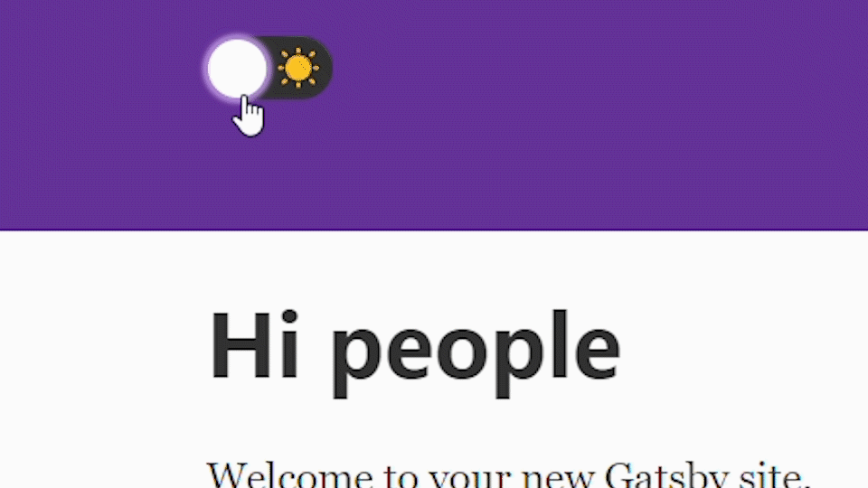

[Github](https://github.com/ptkmc/theme-toggle-tutorial) | [Live Demo](https://hopeful-wing-d32eb9.netlify.com)

Whichever aesthetic you prefer, it's nice to have options.

This highly-clickable project makes a fun introduction to using Context and CSS-in-JS with Gatsby. It was inspired by the toggle in [Dan Abramov's blog](https://overreacted.io).

> Note: Persisting the theme across sessions using localStorage turns out to be a little more complex than you'd think for a static site. Because Gatsby uses server-side rendering at build time, there's a delay between the first paint and hydration, resulting in a flash of unstyled content. Abramov ran into [the same issue](https://twitter.com/dan_abramov/status/1086790808840343552) and detailed his solution, which involves removing context and storing the theme as a custom property in the global window object.

> For a more modular solution I'd recommend checking out [gatsby-plugin-use-dark-mode](https://www.gatsbyjs.org/packages/gatsby-plugin-use-dark-mode/).

## What We'll Be Using

- [Gatsby](https://www.gatsbyjs.org/)
- [Emotion](https://emotion.sh/docs/introduction)
- [react-switch](https://www.npmjs.com/package/react-switch)

## Installing Dependencies

First create a new Gatsby project using the default starter:

```
gatsby new my-theme-toggle && cd my-theme-toggle
```

Then install the other dependencies:

```
npm install --save gatsby-plugin-emotion @emotion/core @emotion/styled react-switch
```

Be sure to add emotion to the list of Gatbsy plugins:

**gatsby-config.js**

```js{3}
plugins: [
  // ...
  `gatsby-plugin-emotion`,
]
```

Then fire up the development server:

```
gatsby develop
```

## Creating the Context Object

To get started let's add a component named `ThemeContext` where we can create a Context object and pass in some default values:

**src/components/ThemeContext.js**

```jsx
import React, { useState } from "react"

export const ThemeContext = React.createContext({
  name: "light",
  updateTheme: () => {},
})
```

From this object we have access to a Provider component. `ThemeContext.Provider` accepts a value prop that will be passed down to consuming components, updating them whenever it changes.

To store and update the theme let's create a stateful component named `ThemeProvider`. This will return the Provider component with a value prop that contains the theme state and a function to update the state.

```jsx
export const ThemeProvider = ({ children }) => {
  const [theme, setTheme] = useState("light")

  return (
    <ThemeContext.Provider
      value={{
        name: theme,
        updateTheme: setTheme,
      }}
    >
      {children}
    </ThemeContext.Provider>
  )
}
```

## Adding the Provider to Gatsby

To consume values from the Provider we could try wrapping it around every `Layout` component in our `pages` directory. That would look something like this:

**src/pages/index.js**

```jsx
import { ThemeProvider } from "../components/ThemeContext"

const IndexPage = () => (
  <ThemeProvider>
      <Layout>
        { // ... }
      </Layout>
  </ThemeProvider>
```

Thankfully Gatsby provides a more elegant solution with its Browser APIs. Using a function called [`wrapRootElement`](https://www.gatsbyjs.org/docs/browser-apis/#wrapRootElement) we can - you guessed it - wrap the root element of every page with our Provider.

**gatsby-browser.js**

```jsx
import React from "react"
import { ThemeProvider } from "./src/components/ThemeContext"
export const wrapRootElement = ({ element }) => (
  <ThemeProvider>{element}</ThemeProvider>
)
```

## Consuming the Context

With our Provider in place we can wrap a Consumer around `Layout`.

**src/components/layout.js**

```jsx{1,7-8,12-13}
import { ThemeContext } from "./ThemeContext"

const Layout = ({ children }) => {
  // ...

  return (
    <ThemeContext.Consumer>
      {theme => (
        <>
        { // ... }
        </>
      )}
    </ThemeContext.Consumer>
}
```

The Consumer takes a function as a child and receives the object in the "value" prop of the Provider as an argument, which we named "theme". We'll use the properties of this "theme" object to style and update our theme.

## Styling the Themes

First let's add a `ThemedLayout` component that we can style with Emotion, replacing the existing fragment.

**src/components/layout.js**

```jsx{4,6}
return (
    <ThemeContext.Consumer>
      {theme => (
        <ThemedLayout theme={theme}>
            { // ... }
        </ThemedLayout>
      )}
    </ThemeContext.Consumer>
}
```

At the top import `@emotion/styled` and create an object with some theme colors:

```jsx
import styled from "@emotion/styled"

const themes = {
  light: {
    foreground: "inherit",
    background: "inherit",
  },
  dark: {
    foreground: "#ffffff",
    background: "#222222",
  },
}
```

Below this, we can now dynamically style `ThemedLayout` based on the current `theme.name` in its "theme" prop.

```jsx
const ThemedLayout = styled.div`
  color: ${props => themes[props.theme.name].foreground};
  background-color: ${props => themes[props.theme.name].background};
  transition: all 0.4s ease;
  min-height: 100vh;

  & a {
    color: ${props => (props.theme.name === "dark" ? "#B38CD9" : "inherit")};
  }
`
```

To test this out, try changing the initial state of `theme` in the `ThemeProvider` component to "dark".

**src/components/ThemeContext.js**

```jsx
const [theme, setTheme] = useState("dark")
```

## Adding the Toggle Switch

Now for the fun part. We'll be adding a `Switch` component to `Header` to toggle the theme state in `ThemeProvider`.

First let's pass the theme object to Header as a prop.

**src/components/layout.js**

```jsx{5}
return (
    <ThemeContext.Consumer>
      {theme => (
        <ThemedLayout theme={theme}>
            <Header siteTitle={data.site.siteMetadata.title} theme={theme} />
            { // ... }
        </ThemedLayout>
      )}
    </ThemeContext.Consumer>
}
```

In this case it makes sense to just pass the "theme" down as a prop, rather than create another Consumer inside `Header`.

> If you only want to avoid passing some props through many levels, component composition is often a simpler solution than context.
>
> <cite>Context docs</cite>

Jumping into the `header.js` file, let's destructure the "theme" prop and call `updateTheme` whenever the Switch changes, using its onChange prop.

**src/components/header.js**

```jsx{1,3,7-12}
import Switch from "react-switch"

const Header = ({ siteTitle, theme }) => (
  <header>
    <div>
      { //... }
      <Switch
        onChange={() =>
          theme.updateTheme(theme.name === "light" ? "dark" : "light")
        }
        checked={theme.name === "dark"}
      />
    </div>
  </header>
)
```

Try it out!

## Styling the Toggle Switch

You can customize the style of the Switch using [special props](https://github.com/markusenglund/react-switch#api). Here's the styling I used - feel free to download the icons from the [github repo](https://github.com/ptkmc/theme-toggle-tutorial/tree/master/src/images) or substitute the `` tags with emojis.

```jsx
import sunIcon from "../images/sun-icon.svg"
import moonIcon from "../images/moon-icon.svg"
```

```jsx
<Switch
  onChange={() => theme.updateTheme(theme.name === "light" ? "dark" : "light")}
  checked={theme.name === "dark"}
  onColor="#222"
  offColor="#333"
  checkedIcon={}
  uncheckedIcon={}
  boxShadow="0 0 2px 3px #B38CD9"
  activeBoxShadow="0 0 2px 3px #dfb3e6"
/>
```

Thanks for reading, hopefully this project helps illustrate some of the potential for using Context and CSS-in-JS with Gatsby.

As I noted at the top, if you're looking to persist the theme across sessions, consider checking out [this discussion](https://twitter.com/dan_abramov/status/1086790808840343552) and [this Gatsby plugin](https://www.gatsbyjs.org/packages/gatsby-plugin-use-dark-mode/).